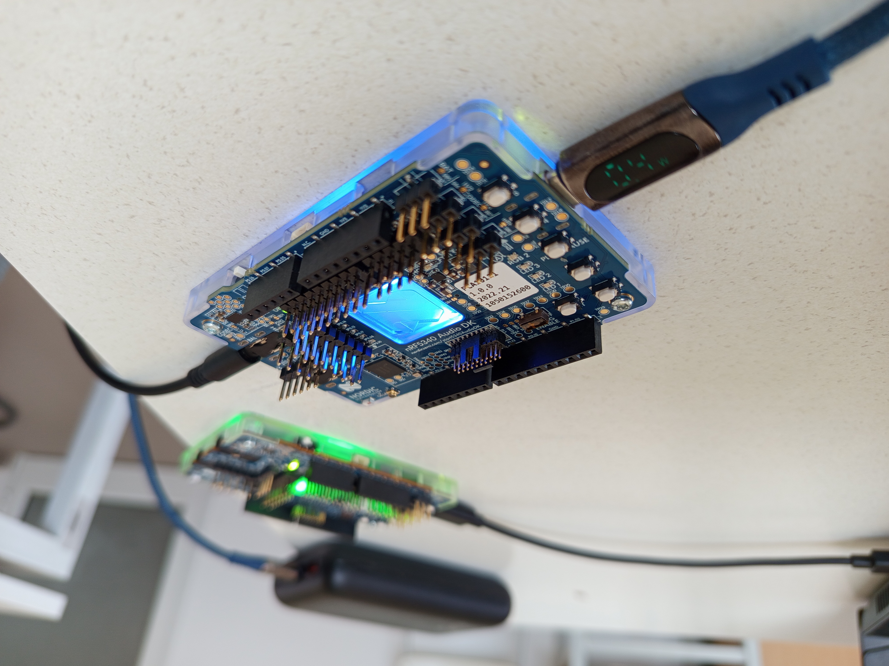

# Real-Time Wireless Audiometry System
### BLE Audio Profile Implementation on Zephyr RTOS for Medical Diagnostics

> A complete embedded medical device for wireless hearing diagnostics, featuring real-time BLE Audio streaming, ambient noise monitoring, and multi-threaded RTOS architecture on Nordic nRF5340


##  Quick Overview

**What:** Medical-grade wireless hearing diagnostic device  
**Hardware:** Nordic nRF5340 Audio DK (dual-core ARM Cortex-M33)  
**Built At:** dB.Sense Innovation Center (5-month internship project)  
**Documentation:** [36-page technical report](my_docs/PFA2_Report_Manar_Mighri.pdf)

---

##  Hardware Setup

<p align="center">
  
  
</p>

---
###  System Demo


*9-second demonstration: Real-time BLE Audio streaming with concurrent ambient noise monitoring. Red LED activate when noise threshold is exceeded (RMS > 400).*


##  Project Overview

This project implements a **real-time embedded audiometric system** designed to address the global hearing loss crisis through accessible, wireless diagnostic tools. Developed in collaboration with **dB.Sense**, the system enables decentralized hearing tests using Bluetooth Low Energy Audio technology.

### Medical Context

According to the World Health Organization, over **430 million people** worldwide suffer from hearing loss, projected to reach **700 million by 2050**. Traditional audiometric testing requires specialized clinical infrastructure, creating accessibility barriers particularly in low-resource settings and for neurodiverse populations.

### Technical Solution

A portable, wireless audiometric platform built on:
- **Nordic nRF5340 Audio DK** (dual-core ARM Cortex-M33)
- **Zephyr RTOS** (real-time task management)
- **BLE Audio** (LC3 codec for low-latency wireless streaming)
- **Ambient noise monitoring** (real-time environmental assessment)

---

##  Key Features

### Core Functionality
-  **Wireless Audio Streaming**: BLE Audio unicast with LC3 codec compression
-  **Real-Time Noise Monitoring**: Concurrent ambient noise measurement via I²S MEMS microphone
-  **Sub-50ms Latency**: End-to-end audio processing for medical-grade diagnostics
-  **Multi-Threaded Architecture**: Priority-based task scheduling under Zephyr RTOS
-  **Visual Feedback System**: RGB LED indicators for noise threshold detection
-  **Dual-Core Utilization**: Network core (BLE stack) + Application core (audio processing)

### Medical/Clinical Features
-  **Decentralized Testing**: Portable system for school, home, or community screenings
-  **Pediatric-Friendly**: Wireless design accommodates movement (autism-friendly)
-  **Environmental Validation**: Real-time noise level monitoring with configurable thresholds
-  **Collective Testing Ready**: Architecture supports future multi-patient screening

---

##  System Architecture

### Hardware Layer
```
nRF5340 Audio DK
├── Dual-Core ARM Cortex-M33 (128 MHz Application Core / 64 MHz Network Core)
├── I²S Interface → MEMS Microphone (ambient noise capture)
├── BLE 5.2 Radio → Wireless headphone connectivity
├── GPIO → RGB LED (visual feedback)
└── UART → Debug/logging interface
```

### Firmware Layer (Zephyr RTOS)
```
Zephyr RTOS Kernel
├── BLE Audio Streaming Task (Priority: High)
│   ├── LC3 Codec Decoding
│   ├── ISO Channel Management
│   └── Audio Playback Synchronization
│
├── Ambient Noise Monitoring Task (Priority: Medium)
│   ├── I²S Sample Acquisition (64-sample windows)
│   ├── RMS Calculation (real-time)
│   └── Threshold Detection Logic
│
└── LED Feedback Task (Priority: Low)
    └── Visual Indicators (noise level alerts)
```

### Communication Layer
```
BLE Audio Stack (Bluetooth 5.2)
├── GATT Profile (service/characteristic management)
├── BAP (Basic Audio Profile - Unicast)
├── LC3 Codec (Low Complexity Communication)
└── ISO Channels (Isochronous streaming)
```

---

## 🔬 Technical Implementation

### 1. Zephyr RTOS Deployment

**Thread Configuration:**
- **Stack Size**: 1024 bytes (noise monitoring thread)
- **Scheduling**: Preemptive, priority-based
- **Interrupt Latency**: <10µs (deterministic real-time)

**Task Creation Example:**
```c
k_tid_t noise_tid = k_thread_create(&noise_thread_data,
                                     noise_thread_stack,
                                     NOISE_THREAD_STACK_SIZE,
                                     noise_level_thread,
                                     NULL, NULL, NULL,
                                     NOISE_THREAD_PRIORITY, 0, K_NO_WAIT);
```

### 2. BLE Audio Integration

**Configuration:**
- **Profile**: BAP Unicast (client/server roles)
- **Codec**: LC3 (hardware-accelerated)
- **Connection Interval**: 10ms
- **Latency Target**: <50ms end-to-end

**Roles:**
- **Unicast Client** (Audio Source): Test signal generator
- **Unicast Server** (Audio Sink): Diagnostic headphones

### 3. Ambient Noise Measurement

**Signal Processing Pipeline:**
```
I²S Microphone → RX FIFO Buffer → RMS Calculation → Threshold Detection → LED Control
```

**RMS Formula:**
```
RMS = sqrt(Σ(x_i²) / N)  where N = 64 samples
```

**Implementation:**
```c
// 64-sample RMS calculation
uint64_t square_sum = 0;
for (size_t i = 0; i < NOISE_SAMPLES_PER_READ; i++) {
    square_sum += (int32_t)samples[i] * samples[i];
}
float rms = sqrtf((float)square_sum / NOISE_SAMPLES_PER_READ);

// Threshold-based LED control
if (rms > 400 && !led_on) {
    gpio_pin_set_dt(&rgb2_red, 1);  // Turn on red LED
    led_on = true;
}
```

**Key Design Decisions:**
- **64-sample window**: Balance between reactivity and CPU load
- **1-second refresh**: Optimizes power consumption while maintaining responsiveness
- **Non-blocking FIFO access**: Prevents interference with BLE streaming

### 4. Dual-Core Architecture

**Network Core:**
- BLE protocol stack execution
- Radio communication management
- LC3 codec hardware acceleration

**Application Core:**
- Zephyr RTOS application logic
- Audio processing and routing
- Ambient noise monitoring
- User interface control

---

##  System Validation & Performance

### Experimental Setup
- **Platform**: 2× nRF5340 Audio DK (client + server)
- **Testing**: BLE streaming + concurrent noise monitoring
- **Validation**: Functional, stress, latency testing

### Performance Metrics
| Metric | Value | Target |
|--------|-------|--------|
| **BLE Connection Interval** | 10 ms | <15 ms |
| **End-to-End Latency** | <50 ms | <50 ms |
| **RMS Computation Time** | 200-250 µs | <1 ms |
| **Noise-to-LED Response** | <1 s | <2 s |
| **RAM Footprint** | 35 KB | <64 KB |
| **Audio Dropout Rate** | 0% | <0.1% |

### Testing Results
 **BLE Audio Streaming**: Stable unicast link with zero dropouts under normal conditions  
 **Noise Monitoring**: Successful RMS calculation and threshold detection  
 **System Coexistence**: No interference between audio streaming and noise processing  
 **Stress Testing**: Maintained performance under high ambient noise (clapping, music)

---

##  Technologies & Tools

### Hardware
- **MCU**: Nordic nRF5340 (dual-core ARM Cortex-M33)
- **Audio Interface**: I²S (MEMS microphone)
- **Wireless**: BLE 5.2 radio
- **Peripherals**: RGB LED, UART debug

### Software Stack
- **RTOS**: Zephyr 3.x
- **SDK**: nRF Connect SDK v2.x
- **Build System**: CMake + West + Ninja
- **BLE Stack**: Zephyr Bluetooth (native LC3 support)
- **Codec**: LC3 (Low Complexity Communication)
- **Tools**: GDB, RTT (Real-Time Transfer), Logic Analyzer

### Development Environment
- **IDE**: Visual Studio Code + nRF Connect Extension
- **Debugger**: Segger J-Link
- **Version Control**: Git
- **Configuration**: Kconfig + Device Tree (DTS)

---

##  Project Structure

```
BLE_HEADPHONES_FOR_AUDIOMETRY/
├── applications/nrf5340_audio/
│   ├── src/
│   │   ├── audio_system.c         # Audio pipeline + noise thread
│   │   ├── main.c                 # Application entry point
│   │   ├── unicast_client.c       # BLE Audio client (transmitter)
│   │   └── unicast_server.c       # BLE Audio server (receiver)
│   │
│   ├── include/
│   │   └── audio_system.h         # Audio subsystem interface
│   │
│   ├── boards/
│   │   └── nrf5340_audio_dk_nrf5340_cpuapp.overlay  # Device tree
│   │
│   ├── prj.conf                   # Kconfig settings
│   └── CMakeLists.txt             # Build configuration
│
├── doc/
│   └── PFA2_Report_Manar_Mighri.pdf  # Full technical report (36 pages)
│
└── README.md
```

---

##  Getting Started

### Prerequisites
- **nRF Connect SDK** v2.x or later
- **West** meta-tool
- **Nordic nRF5340 Audio DK** (2× boards for testing)
- **J-Link** debugger

### Installation

1. **Clone the repository:**
```bash
git clone https://github.com/mighri-manar/BLE_HEADPHONES_FOR_AUDIOMETRY.git
cd BLE_HEADPHONES_FOR_AUDIOMETRY
```

2. **Initialize west workspace:**
```bash
west init -l
west update
```

3. **Build the unicast server (diagnostic headphones):**
```bash
cd applications/nrf5340_audio
west build -b nrf5340_audio_dk_nrf5340_cpuapp -- -DCONFIG_AUDIO_DEV=HEADSET
```

4. **Build the unicast client (test signal source):**
```bash
west build -b nrf5340_audio_dk_nrf5340_cpuapp -- -DCONFIG_AUDIO_DEV=GATEWAY
```

5. **Flash firmware:**
```bash
west flash
```

6. **Monitor logs:**
```bash
west espressif monitor
```

### Configuration

**Key Kconfig Options:**
```
CONFIG_BT_AUDIO=y                  # Enable BLE Audio
CONFIG_BT_BAP_UNICAST=y            # Enable unicast profile
CONFIG_BT_LC3=y                    # Enable LC3 codec
CONFIG_STREAM_BIDIRECTIONAL=y      # Enable microphone input
CONFIG_AUDIO_DEV=HEADSET           # Server role (diagnostic headphones)
```

**Noise Monitoring Threshold:**
```c
#define NOISE_THRESHOLD_RMS 400    # Empirical threshold (adjust as needed)
```

---

##  Testing & Validation

### Unit Testing
```bash
# Test BLE Audio streaming alone
west build -t run

# Test noise monitoring thread alone
# (with BLE Audio disabled in prj.conf)
```

### Integration Testing
1. Flash both boards (client + server)
2. Power on both devices
3. Verify BLE connection establishment (LED indicators)
4. Connect headphones to server board
5. Introduce ambient noise (clapping, speaking)
6. Observe red LED response on server board

### Stress Testing
- Play continuous music near device
- Monitor for audio dropouts (should be zero)
- Verify LED toggles correctly with noise levels

---

## 📈 Performance Analysis

### Memory Footprint
- **Total RAM**: 128 KB available
- **Used RAM**: ~35 KB (27% utilization)
- **Headroom**: 93 KB for future features

### CPU Utilization
- **BLE Audio Task**: ~40% (priority: high)
- **Noise Monitoring**: ~15% (priority: medium)
- **LED Control**: <5% (priority: low)
- **Idle**: ~40%

### Latency Breakdown
```
Audio Path:
Microphone → I²S (0ms) → FIFO (2ms) → LC3 Encode (8ms) → 
BLE TX (10ms) → BLE RX (10ms) → LC3 Decode (8ms) → Speaker (2ms)
Total: ~40ms (within <50ms target)
```

---

##  Future Work

### Short-Term Enhancements
- [ ] **Dynamic Thresholding**: Adaptive noise level detection based on moving averages
- [ ] **dB SPL Calibration**: Map RMS values to physical sound pressure levels
- [ ] **Extended Testing**: Validation in clinical settings with medical personnel

### Mid-Term Development
- [ ] **Active Noise Cancellation (ANC)**: Use microphone data to generate anti-noise signals
- [ ] **Mobile App Integration**: Bluetooth connection to smartphone for test control
- [ ] **Cloud Data Sync**: Upload audiograms to secure medical database
- [ ] **Multi-Language UI**: Support for international deployment

### Long-Term Vision
- [ ] **BLE Audio Broadcast (Auracast™)**: Collective testing of multiple patients simultaneously
- [ ] **AI-Assisted Diagnosis**: Machine learning for automated hearing loss classification
- [ ] **Low-Cost Hardware**: Port to ESP32-based platform for wider accessibility
- [ ] **Medical Certification**: Pursue FDA/CE marking for clinical deployment

---

## 📄 Documentation

### Technical Report
A comprehensive **36-page academic report** is included in `my_docs/PFA2_Report_Manar_Mighri.pdf`, covering:
- Medical and societal context (WHO hearing loss crisis)
- System architecture and design decisions
- Implementation details (RTOS, BLE Audio, noise monitoring)
- Experimental validation and performance analysis
- Future development roadmap

**Key Sections:**
1. **Chapter 1**: Problem analysis and motivation
2. **Chapter 2**: Architectural design and technology selection
3. **Chapter 3**: Implementation and validation

### Additional Resources
- [Nordic nRF5340 Audio DK Product Brief](https://www.nordicsemi.com/Products/Development-hardware/nRF5340-Audio-DK)
- [Zephyr RTOS Documentation](https://docs.zephyrproject.org/)
- [nRF Connect SDK Documentation](https://developer.nordicsemi.com/nRF_Connect_SDK/doc/latest/nrf/index.html)
- [Bluetooth LE Audio Specifications](https://www.bluetooth.com/specifications/le-audio/)

---


### Technical Contributions
-  First implementation of BLE Audio for medical audiometry in Tunisia
-  Validated dual-core RTOS architecture for real-time medical devices
-  Demonstrated feasibility of wireless diagnostic headphones
-  Open-source foundation for future embedded audio projects


---

##  Contact

**Email**: manar.mighri@etudiant-enit.utm.tn  
**LinkedIn**: [Manar Mighri](https://linkedin.com/in/manar-mighri)  


---

##  License

This project is based on the [nRF Connect SDK](https://github.com/nrfconnect/sdk-nrf) and follows its original licensing terms.

**Base SDK License**: Apache 2.0 / Nordic 5-Clause BSD  
**Modifications**: © 2024-2025 Manar Mighri / dB.Sense


---

##  Acknowledgments

Special thanks to:
- **dB.Sense team** for providing hardware
- **Nordic Semiconductor** for excellent SDK documentation and support
- **Zephyr Project community** for RTOS foundation

---

##  References

[1] World Health Organization. "World Report on Hearing" (2021)  
[2] Bluetooth SIG. "Bluetooth LE Audio Specifications" (2020)  
[3] Zephyr Project Documentation (2024)  
[4] Nordic Semiconductor. "nRF5340 Audio DK Product Brief" (2023)  
[5] Nordic Semiconductor. "nRF Connect SDK Documentation" (2024)

---

**Keywords**: Embedded Systems, Medical Devices, BLE Audio, Zephyr RTOS, Real-Time Systems, nRF5340, Audiometry, Hearing Diagnostics, LC3 Codec, Wireless Audio, Multi-Threading, ARM Cortex-M33, I²S, Signal Processing, Healthcare Technology

---

*This project contributes to making hearing diagnostics more accessible, portable, and patient-centered, addressing a critical global health challenge through innovative embedded systems engineering.*

---

<div align="center">


**Made with ❤️ and ☕ by Manar**


</div>
